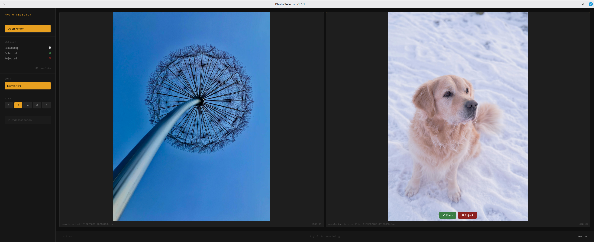

# Photo Selector

A fast, keyboard-driven photo culling tool built with Rust and Tauri. Open a folder, keep or reject images with a single keypress, and move on. No cloud, no subscription, no bloat.



---

## Features

- **Fast scanning** — indexes large folders instantly with a live progress counter
- **Grid view** — review 1, 2, 4, 6, or 8 images at a time
- **Keyboard first** — navigate and action images without touching the mouse
- **Non-destructive** — files are moved to `selected/` or `rejected/` subfolders, never deleted
- **Undo** — restore the last actioned image with Cmd/Ctrl+Z
- **Sort** — reorder by name, date modified, or file size
- **Session stats** — live progress bar showing how many images remain
- **Cross-platform** — Linux, Windows, macOS

---

## Keyboard Shortcuts

| Key | Action |
|-----|--------|
| `→` or `Space` | Next page |
| `←` | Previous page |
| `S` | Select (keep) — 1-up view only |
| `R` | Reject — 1-up view only |
| `Cmd/Ctrl + Z` | Undo last action |

---

## How It Works

When you open a folder, Photo Selector scans for supported image files and builds an index. From there, navigate through your images and press **Keep** or **Reject** on each one. Files are moved into subfolders alongside your originals:

```
your-photos/
  IMG_001.jpg        ← untouched originals stay here
  IMG_002.jpg
  selected/
    IMG_003.jpg      ← kept images
  rejected/
    IMG_004.jpg      ← rejected images
```

Undo moves the file back to the original folder and restores it to the index.

---

## Supported Formats

JPEG, PNG, WebP, GIF, BMP, TIFF

---

## Installation

### Linux

Download the latest release from the [Releases](../../releases) page.

**AppImage** (no install required):
```bash
chmod +x photo-selector_*.AppImage
./photo-selector_*.AppImage
```

**Debian / Ubuntu**:
```bash
sudo dpkg -i photo-selector_*.deb
```

### Windows

Download and run the `.exe` installer from the [Releases](../../releases) page.

### macOS

> macOS builds are not currently distributed. See [Building from Source](#building-from-source) below.

---

## Building from Source

### Prerequisites

- [Rust](https://rustup.rs/) (stable)
- [Node.js](https://nodejs.org/) 18 or later
- [Tauri CLI v2](https://tauri.app/start/prerequisites/)

**Linux** — additional system libraries:
```bash
sudo apt-get install -y \
  libwebkit2gtk-4.1-dev \
  libappindicator3-dev \
  librsvg2-dev \
  patchelf
```

### Development

```bash
git clone https://github.com/yourname/photo-selector.git
cd photo-selector
npm install
cargo tauri dev
```

### Release Build

```bash
cargo tauri build
```

Output is in `src-tauri/target/release/bundle/`.

---

## Project Structure

```
photo-selector/
  core/               Rust library — all business logic
    src/
      app_state.rs    Main state machine
      events.rs       All events the app can emit
      image_cache.rs  Image metadata cache
      image_index.rs  Sorted image index with scan
      navigation.rs   Page navigation engine
      stats.rs        Session statistics
      undo.rs         Undo stack
  src-tauri/          Tauri backend
    src/
      commands.rs     Tauri command handlers
      state.rs        Shared app state wrapper
      lib.rs          App entry point
  src/                React frontend
    components/
      App.tsx
      ImageGrid.tsx
      MainView.tsx
      NavBar.tsx
      Sidebar.tsx
      ScanOverlay.tsx
    store/
      appStore.ts     Zustand global state
      events.ts       TypeScript event types
    hooks/
      useKeyboard.ts  Keyboard shortcut handler
```

---

## Architecture

Photo Selector has a clean separation between logic and presentation:

**Core** is a pure Rust library with no Tauri dependency. It can be used headlessly via the included CLI or tested independently. All state changes are expressed as `AppEvent` values — the core never pushes to the UI directly.

**Tauri backend** owns the bridge between core and frontend. Commands lock the shared `AppState`, call core methods, and forward the resulting events to the WebView via Tauri's event system.

**Frontend** is a React app that maintains a Zustand store updated entirely by incoming events. Components never call each other directly — they read from the store and invoke Tauri commands.

```
User action
  → invoke() Tauri command
  → AppState method → Vec<AppEvent>
  → emit() to WebView
  → applyEvent() → Zustand store update
  → React re-render
```

---

## CI / Releases

Builds are automated via GitHub Actions. Push a version tag to trigger a release build for Linux and Windows:

```bash
git tag v1.0.0
git push origin v1.0.0
```

Artifacts (`.deb`, `.AppImage`, `.exe`, `.msi`) are uploaded automatically and attached to the GitHub release.

---

## License

MIT — see [LICENSE](LICENSE) for details.
